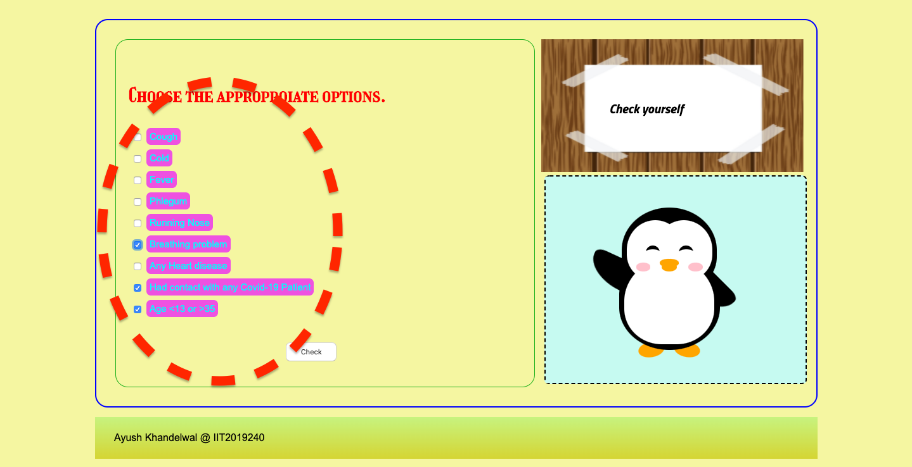
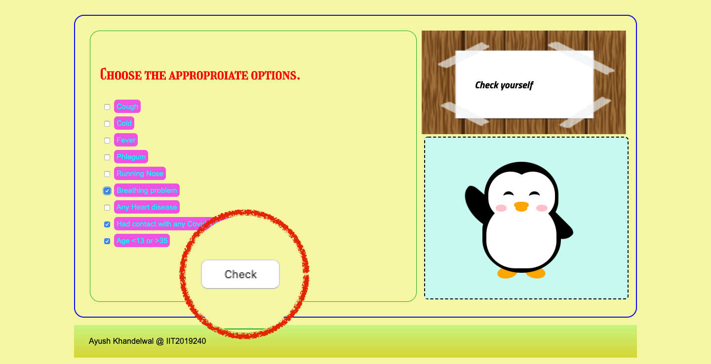
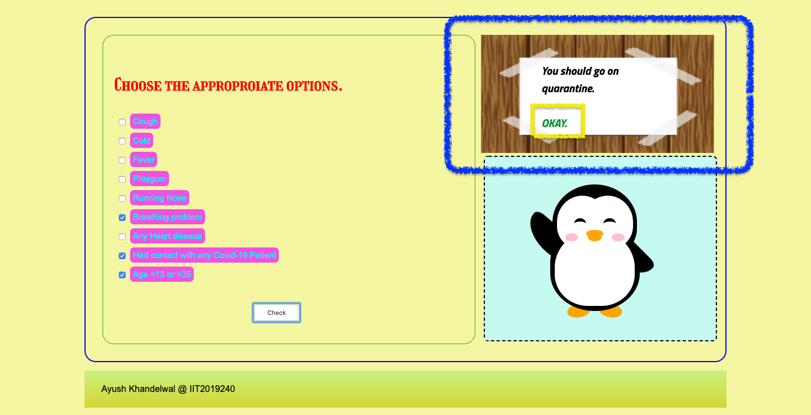

# SGR-2
This repository is made to handle and host a web page for round-2 of the **WebD Wing-Geekhaven IIITA** Member Selction.

By-*Ayush Khandelwal,IIT2091240*

---

## Covid-19
* ### Baic info
    Coronavirus disease 2019 (COVID-19) is an infectious disease caused by severe acute respiratory syndrome coronavirus 2 (SARS-CoV-2).It was first identified in December 2019 in Wuhan, China, and has since spread globally, resulting in an ongoing pandemic. As of 17 May 2020, more than 4.65 million cases have been reported across 188 countries and territories, resulting in more than 312,000 deaths. More than 1.7 million people have recovered.

* ### Content of this page
    This page provides a link to the most basic requirements that are needed to have a complete overlook of the current situation at one place. Moreover , this page also gives the mythbusters and the ways of usage of equipments with the video sample providing a basic precautions and knowledge required to overcome the present day scenario.

    Further one can go to the precautionary test and have a quick check up and know about his/her conditions and know what they should do further.

---
## Cloning the project to your local machine.

1. Make sure your machine is having internet connection.
1. Open shell (which ever your OS support) on your PC.
1. Change drive to the location where you want your project to  be copied
1. Now type or copy-paste the below given commands.
```bash
    git clone https://github.com/Ayush-Khandelwal-007/SGR-2.git
```
5. Press Enter and you will see some downloading statmets as shown below:
```bash
    Cloning into 'SGR-2'...
    remote: Enumerating objects: 45, done.
    remote: Counting objects: 100% (45/45), done.
    remote: Compressing objects: 100% (33/33), done.
    remote: Total 45 (delta 20), reused 32 (delta 10), pack-reused 0
    Unpacking objects: 100% (45/45), done.
```
---

## Dependencies

1. Browser compatibility

    | Browsers      | Their downloading link                                                                                                                |
    |---------------|---------------------------------------------------------------------------------------------------------------------------------------|
    | Firefox 3.5+  | [Download Link](https://www.mozilla.org/en-US/firefox/download/thanks/)                                                               |
    | Google Chrome | [Download Link](https://www.google.com/chrome/?brand=CHBD&gclid=EAIaIQobChMIrang1ta76QIVln8rCh1wVw3cEAAYASAAEgImhvD_BwE&gclsrc=aw.ds) |
    | Opera 12+     | [Download Link](https://www.opera.com/download)                                                                                       |
    | Safari 6+     | [Download Link](https://support.apple.com/en-us/HT204416)                                                                             |


2. A text editor or preferably an IDE(Integrated development environment) to make things works more easier and comfortable. Like

    1. Visual Studio
    1. Xcode
    1. Atom
    1. Brackets

___

## Running the project locally.

### Open the [index.html](index.html) file with the downloaded browser.

Right click on the index.html file and select option:
> open with

and then select the 
>browser (with which you want to open the page).

### How to use the **Precautionary** test

1. Select the appropriate options from the given choices.

    
1. Click on the check option below the options.

    
1. Check on the screen for the steps to be taken. And then click on **okay** to refresh the form.

    

___

## Contributing to the project

1. Fork this repository from the above given option.
1. Then clone the forked project on your device.
1. Make changes in code in the local copy of the project and add comments using comment tag and state its use and way of working.
1. Then push your locally changed project to your forked repository.
1. Then raise a pull request to the main branch specifying all the changes in the listed format with a brief discription.

___

# Explanation to code

## index.html
1. 
```html
    <link rel="stylesheet" href="styling.css">
    <script type="text/javascript" src="code.js"></script>

``` 

This part in the file is to attach the css style sheet and the javascript file.

2. 
```html
    <div id="header"><!--The heading part-->
        ..........
    </div>

```
This part contains the header including the heading and the logo to the page.

3. 
```html 
    <div id="menu" >
        ....
    </div>
```
This makes up the navigation bar.

4. 
```html 
    <div id="introduction"><!--Printing The mythbusters-->
        <h3>Myth Busters</h3>.......
    </div>
```
 5. 
This part makes the portion of the page giving information about the myth busters.

```html
    <div class="leftsidebar"><!--Usage of mask-->
                <div class="sidebar">
                    ....
                </div>
                <div class="vide"><!--mask usage visual example-->
                ....
                </div>
            </div>
```

This whole div occurs twice containing stepsand a video tutorial for using equipments.

6. 
```html
    <div id="haha"><div><h2>A fast precautionary test</h2></div></div>
            <div class="test"><!--The test block-->
                <div class="form">
                    <h3>Choose the approproiate options.</h3>
                    ........
                    <br><br>
                    <button id="bt">Check</button>
                </div>
                <div class="visuals">
                    <div class="animation">
                        <iframe src="try.html"  id="pg"></iframe>
                    </div>
                    <div class="message" id="mess">
                        <div id="dialouge">
                            <p>Check yourself</p>
                        </div>
                    </div>
                </div>
            </div>
```

This part of the code makes up the test region including a heading , a form part , and an Visual part. In which Visual is further divide in maessage and the animation part, which changes according to the form filled using the java script.


## Code.js
1. 

```javascript
    document.getElementById("bt").onclick=function(){
        var c=0;
        var t=document.getElementById("1");
        if(t.checked == true)
        {
            c+=1;
        }
        var t=document.getElementById("2");
        if(t.checked == true)
        {
            c+=1;
        }
        var t=document.getElementById("3");
        if(t.checked == true)
        {
            c+=1;
        }
        var t=document.getElementById("4");
        if(t.checked == true)
        {
            c+=1;
        }
        var t=document.getElementById("5");
        if(t.checked == true)
        {
            c+=1;
        }
        var t=document.getElementById("6");
        if(t.checked == true)
        {
            c+=1;
        }
        var t=document.getElementById("7");
        if(t.checked == true)
        {
            c+=1;
        }

``` 

This part of the functioion incresed the value of **"c"**  which  are some small symptoms input from the form.

2. 
```javascript
     if(c>=4){
            x=1;
    }
    if (document.getElementById("8").checked == true)
    {
        y=1;
    }
    if (document.getElementById("9").checked == true)
    {
        z=1;
    }
```

This part of functiion assigns total value including major and minor issues.

3. 
```javascript
     if(x+y+z==0)
        {
            document.getElementById("dialouge").innerHTML="<p>You are totally fine.<br><br><a href=\"#\" onclick=\"window.location.reload(true);\">   Okay.</a></p>"
        }
        if(x+y+z==1)
        {
            document.getElementById("dialouge").innerHTML="<p>Maintain social distancing.<br><br><a href=\"#\" onclick=\"window.location.reload(true);\">   Okay.</a></p>"
        }
        if(x+y+z==2)
        {
            document.getElementById("dialouge").innerHTML="<p>You should go on quarantine.<br><br><a href=\"#\" onclick=\"window.location.reload(true);\">   Okay.</a></p>"
        }
        if(x+y+z==3)
        {
            document.getElementById("dialouge").innerHTML="<p>Contant to doctor as soon as possible.<br><br><a href=\"#\" onclick=\"window.location.reload(true);\">   Okay.</a></p>"
        }
```

And finally this part of the code changes the content of the page according to the total value and give the message accordingly to the user.

## try.html

This file mainly shows up that the styling could be done within the css file only.

Also it is used to show the use of iframe to show another page within a page.

1. 
```html
    <div class="penguin-bottom">
    <div class="right-hand"></div>
    <div class="left-hand"></div>
    <div class="right-feet"></div>
    <div class="left-feet"></div>
    </div>
```

This part makes up the lower part of the penguin- 

        * the stomach
        * the hands 
        * the feet

Whose alignment , shape and position is set using the css properties above.

2. 
```html
    <div class="penguin-top">
    <div class="right-cheek"></div>
    <div class="left-cheek"></div>
    <div class="belly"></div>
    <div class="right-eye">
      <div class="sparkle"></div>
    </div>
    <div class="left-eye">
      <div class="sparkle"></div>
    </div>
    <div class="blush-right"></div>
    <div class="blush-left"></div>
    <div class="beak-top"></div>
    <div class="beak-bottom"></div>
```

This part makes up the upper part of the penguin- 

        * the face
            * Cheeks
            * Eyes
                *sparkle 
            * beak

Whose alignment , shape and position is set using the css properties above.
